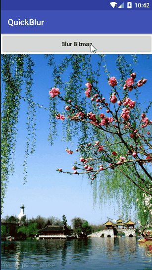

## QuickBlur
使用RenderScript对图片进行高斯模糊处理封装的一个工具类,使用Builder构建 
博客地址: [http://blog.csdn.net/fendoudebb/article/details/76177203](http://blog.csdn.net/fendoudebb/article/details/76177203)

## 样例演示

## 引入
### 添加依赖
```java
dependencies {
	compile 'com.fendoudebb.util:quickblur:1.0.0'
}
```
## 使用
```java
QuickBlur.with(getApplicationContext()).bitmap(srcBitmap).blur();
```
## RenderScript官方文档
[https://developer.android.google.cn/guide/topics/renderscript/compute.html](https://developer.android.google.cn/guide/topics/renderscript/compute.html)


